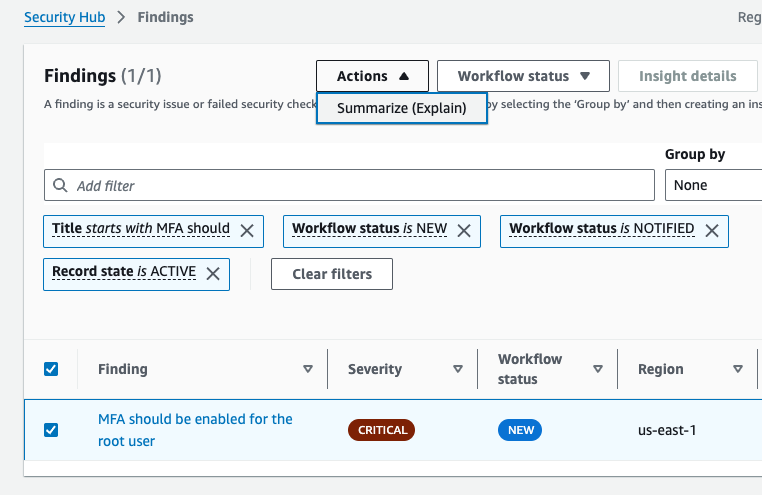
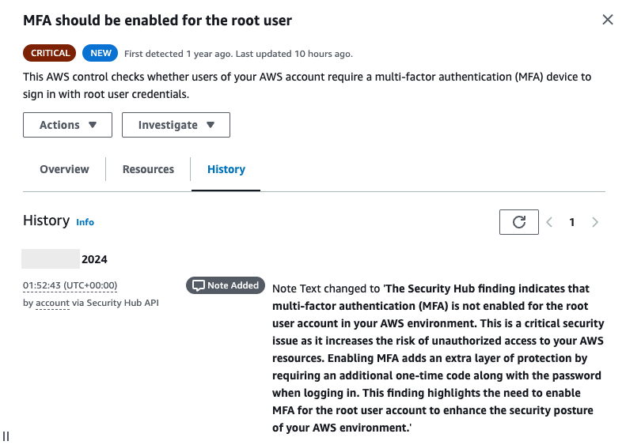

## Use generative AI to summarize Security Hub findings

>[!TIP]
> For a step-by-step tutorial, review the post on [AWS Community](https://community.aws/content/2nqQZeWUhyjc3AH03fdnmhczwgM/use-generative-ai-to-summarize-security-hub-findings).

## Overview of Solution

This solution creates a custom action that sends specific Security Hub findings to EventBridge. An EventBridge rule listens for the event, and invokes an AWS Lambda function. The Lambda function invokes the Amazon Bedrock service to summarize the finding. The finding details are updated in Security Hub with a simplified summary for the user to review. 

## Deployment 

### Prerequisites

-	[Enable AWS Security Hub](https://docs.aws.amazon.com/securityhub/latest/userguide/securityhub-settingup.html) with at least one finding.
-	[Enable model access](https://docs.aws.amazon.com/bedrock/latest/userguide/model-access.html) to Anthropic Claude 3.5 Sonnet.

### Steps

1. Create a custom action named **Summarize (Explain)**
2. Deploy the CloudFormation template contained in this repository. For **pCustomActionARN** parameter, enter the ARN from step 1.
3. Select a finding you to summarize, and choose **Actions**, **Summarize (Explain)**.
   
4. You view the result on the **history** tab.
   

## Updating the prompt
The system prompt will change how the summarizes are created. To learn prompt engineering, visit the [prompt engineering guidelines](https://docs.aws.amazon.com/bedrock/latest/userguide/prompt-engineering-guidelines.html) in the Amazon Bedrock user guide. The function will include the first 512 characters when updating the finding note.

## Security

See [CONTRIBUTING](CONTRIBUTING.md#security-issue-notifications) for more information.

## License

This library is licensed under the MIT-0 License. See the LICENSE file.