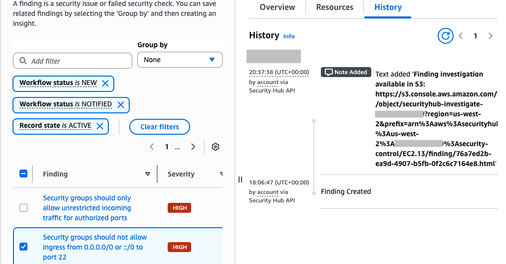
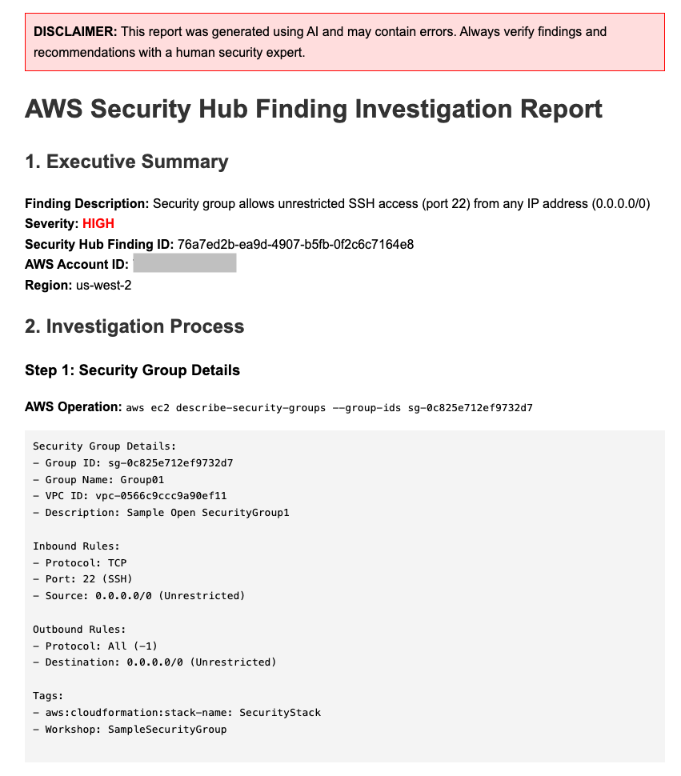

## Use generative AI to summarize Security Hub findings

>[!TIP]
> For a step-by-step tutorial, review the post on [AWS Community](https://community.aws/content/2nqQZeWUhyjc3AH03fdnmhczwgM/use-generative-ai-to-summarize-security-hub-findings).

## Overview of Solution

This solution creates a custom action that sends specific Security Hub findings to EventBridge. An EventBridge rule listens for the event, and invokes an AWS Lambda function. The Lambda function invokes the Amazon Bedrock service to summarize the finding. The finding details are updated in Security Hub with a simplified summary for the user to review. 

## Deployment 

### Prerequisites

-	[Enable AWS Security Hub](https://docs.aws.amazon.com/securityhub/latest/userguide/securityhub-settingup.html) with at least one finding.
-	[Enable model access](https://docs.aws.amazon.com/bedrock/latest/userguide/model-access.html) to Anthropic Claude 3.5 Haiku.

### Steps
This solution has two examples, summarize and investigate. You can choose which to enable by entering a customer action ARN as a parameter when deploying the CloudFormation template. If you leave the parameter null, the infrastructure will not be created for that example.

### Deploy the solution
In this step, you will create a custom action to summarize and/or investigate a Security Hub finding with generative AI.

1. (Optional) Create a custom action named **Summarize (Explain)** 
2. (Optional) Create a custom action named **Investigate**
3. Deploy the CloudFormation template contained in this repository. For **pCustomActionSummarizeARN** parameter, enter the ARN from step 1. For **pCustomActionInvestigateARN** parameter, enter the ARN from step 1.
5. Select a finding you to summarize, and choose **Actions**, **Summarize (Explain)**.
   
6. You view the result on the **history** tab.
   

#### Review the investigation report
If you deployed the investigation action you can review the report saved in S3.
1. Select the finding you want to investigate and choose **Investigate**.
2. On the history tab, copy the S3 location of the report.
   
3. Review the report in S3.
   

### Updating the prompt
The system prompt will change how the summarizes are created. To learn prompt engineering, visit the [prompt engineering guidelines](https://docs.aws.amazon.com/bedrock/latest/userguide/prompt-engineering-guidelines.html) in the Amazon Bedrock user guide. The function will include the first 512 characters when updating the finding note.

The prompts for the generative AI are stored in [Amazon Bedrock Prompt Management](https://aws.amazon.com/bedrock/prompt-management/).

For instructions on how to update, review [Update the prompt](https://catalog.us-east-1.prod.workshops.aws/workshops/2b5e9803-c034-4504-a0c8-1f609512c198/en-US/40-mod2#step-5:-update-the-prompt) in the [Use generative AI to enhance Security Hub findings workshop](https://catalog.us-east-1.prod.workshops.aws/workshops/2b5e9803-c034-4504-a0c8-1f609512c198/en-US).

## Security

See [CONTRIBUTING](CONTRIBUTING.md#security-issue-notifications) for more information.

## License

This library is licensed under the MIT-0 License. See the LICENSE file.